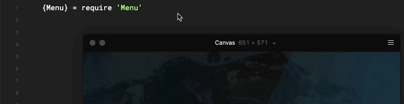
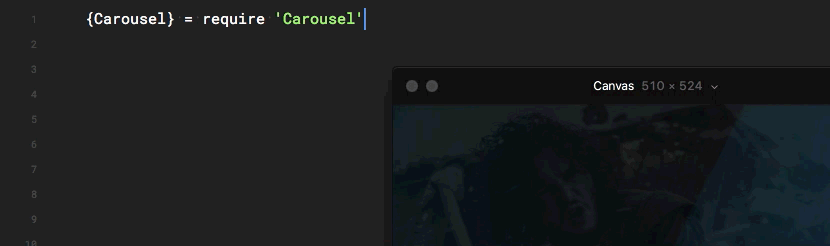
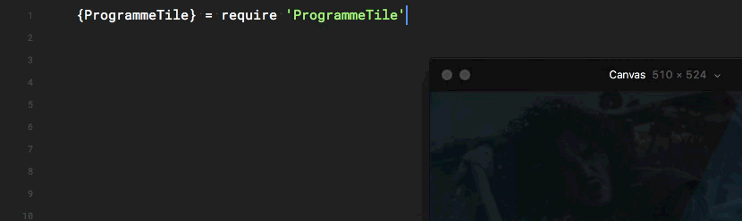

# TVKit – TV Prototyping for Framer Classic

TVKit is a number of modules for TV prototyping that are highly customisable. It's designed with remote controls in mind but works just as well with keyboard input. I'd tried a number of libraries that attempted to _guess_ your next move using some maths but I found some of these to be a little frustrating when creating custom components. For this I built `Navigables` which expects explicitly defined behaviour when defining interaction logic. Many of the following components are extended from the `Navigables` class.

## Adding TVKit to your project
To add all the TVKit functionality to your project, just copy the modules folder into the root of your project folder and type the following at the top of your project.

```
TVKit = require "TVKit"
```

## Navigables
Navigables are essentially just a layer that require a `highlight` state and a `removeHighlight` state. In order to invoke these states, you'll also need a Highlight object. This can be viewed in the `navigables-example.framer` file.

## Highlight
Highlight must be defined after the rest of the Navigation logic as it attaches to the `Navigables` on creation. This can also be viewed in the `navigables-example.framer` file.

## Menus
You can create as many menus as you like:
```
mainMenu = new Menu
```



To define the contents of a menu, you can use:

```
itemsArray = ['Guide', 'MyTV', 'Discover','Settings']

contentArray = [guideCarousel, myTVCarousel, discoverCarousel, settingsCarousel]

mainMenu = new Menu
    items: contentsArray
    menuContent: contentArray
```

Then, you can place the menu in 2 different states:

```
mainMenu.highlight(1)
mainMenu.select(1)
```

The number selects the index of the menu item so in this case MyTV would be selected.
## Carousels
Similarly with carousels...

```
{Carousel} = require 'Carousel'
guideMainMenu = new Carousel
```



## Tiles
And finally with programme tiles –

```
{ProgrammeTile} = require 'ProgrammeTile'
heartbeat = new ProgrammeTile
```



----
If you'd like to know more, give me a shout — [@struanfraser](http://twitter.com/struanfraser)